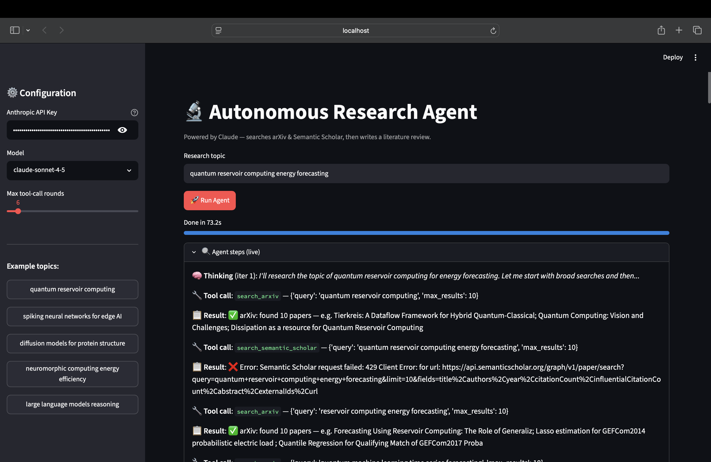
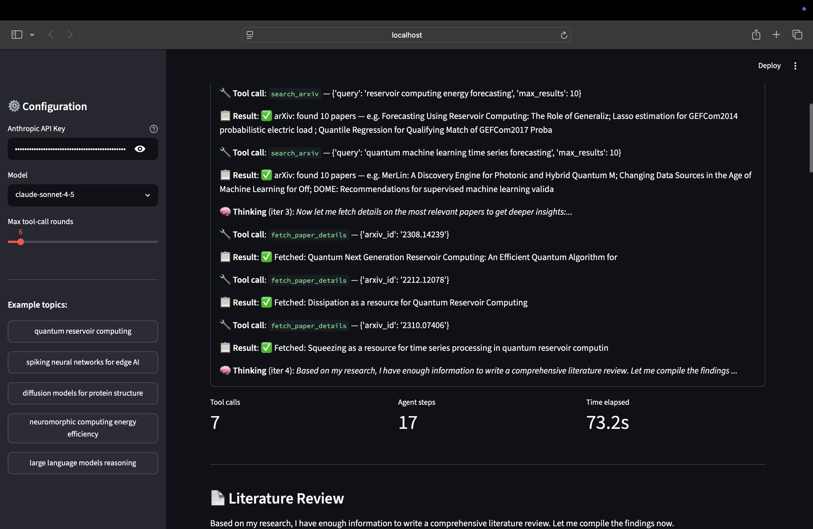
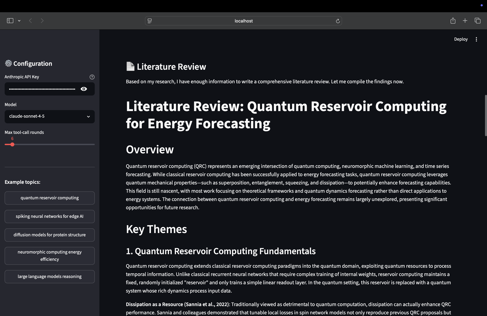
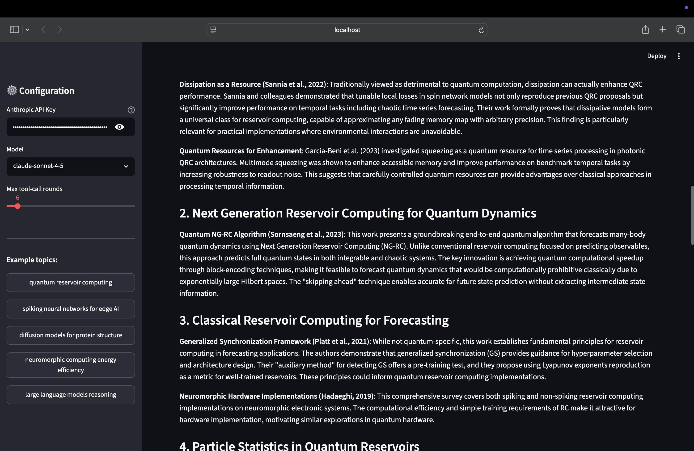
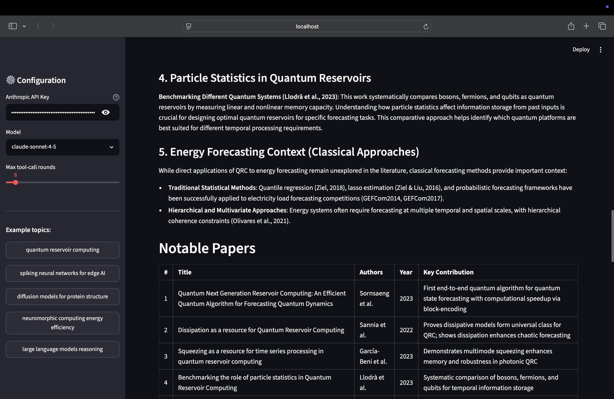
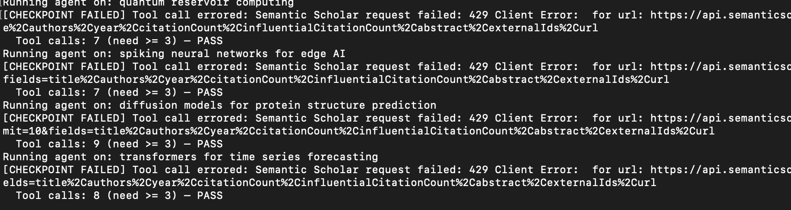

## 🧠 How it works

The agent loop in `agent/core.py` is pure ReAct — no frameworks, no abstractions:

# 🔬 Autonomous Research Agent

An AI agent that autonomously researches any academic topic — searching arXiv and Semantic Scholar, reading abstracts, and synthesizing a structured, citation-backed literature review. Built directly on the raw **Anthropic SDK** using the **ReAct** (Reason + Act) pattern, with no agent framework or scaffolding in between.

**[Try it live on Streamlit Cloud →](https://autonomous-research-agent.streamlit.app)**
*(replace with your actual deployed URL)*

---

## What it does

Give it a research topic, and the agent will:
1. Reason about what to search for
2. Query arXiv and Semantic Scholar for relevant papers
3. Fetch details and citation counts on the most promising results
4. Decide whether it has enough to conclude or needs to search further
5. Synthesize everything into a structured literature review, complete with citations

All of this happens through an explicit, inspectable reasoning loop — every "thought," tool call, and observation is visible, not hidden behind a black-box chain.

## ✨ Features

- **4 real tools**: arXiv search, Semantic Scholar search (with citation counts), a paper-detail fetcher, and a web scraper
- **ReAct agent loop**: Claude reasons → picks a tool → observes the result → reasons again, iterating until it's ready to conclude
- **Streamlit UI** with live, step-by-step visibility into the agent's reasoning and tool calls
- **CLI mode** for terminal use, scripting, or batch runs
- **Downloadable Markdown report** for every completed literature review

## 🧠 How it works

```
User topic
   ↓
Claude reasons about what to search
   ↓
Claude calls a tool (e.g. search_arxiv)
   ↓
Tool result added to context
   ↓
Claude reasons again — refine, fetch details, or conclude
   ↓
... repeats up to max_iterations ...
   ↓
Claude writes the final structured report
```

This is a deliberately minimal, transparent implementation: no LangChain, no LangGraph, no agent framework — just raw Anthropic SDK calls with native tool use. The entire agent loop lives in `agent/core.py` and is short enough to read start to finish in a few minutes.

## 🗂️ Project Structure

```
research-agent/
├── app.py                ← Streamlit UI
├── run_cli.py             ← CLI runner
├── requirements.txt
├── .env.example            ← Copy to .env and add your API key
├── agent/
│   ├── core.py            ← ReAct agent loop (the brain)
│   └── prompts.py          ← System + user prompts
└── tools/
    └── search_tools.py      ← 4 tools: arXiv, Semantic Scholar, fetcher, scraper
```

## 🚀 Setup

**Requirements:** Python 3.9+, an [Anthropic API key](https://console.anthropic.com/), and internet access (arXiv and Semantic Scholar APIs are free and keyless).

```bash
# 1. Clone the repo
git clone https://github.com/mansi59054/autonomous-research-agent.git
cd autonomous-research-agent

# 2. Create a virtual environment (recommended)
python -m venv venv
source venv/bin/activate      # Windows: venv\Scripts\activate

# 3. Install dependencies
pip install -r requirements.txt

# 4. Add your API key
cp .env.example .env
# Open .env and paste your Anthropic API key
```

### Run it

**Streamlit UI (recommended):**
```bash
streamlit run app.py
# Opens at http://localhost:8501
```

**CLI:**
```bash
python run_cli.py "quantum reservoir computing"
python run_cli.py "spiking neural networks" --output review.md
```

## 💡 Example Topics to Try

- `quantum reservoir computing`
- `spiking neural networks for edge AI`
- `diffusion models for protein structure prediction`
- `neuromorphic computing energy efficiency`
- `transformers for time series forecasting`

# 🔬 Demo

Type a topic. Get a structured literature review with citations in under 2 minutes.



An AI agent that autonomously researches any academic topic — searching arXiv & Semantic Scholar, reading abstracts, and producing a structured literature review with citations. Built on the **ReAct** pattern using the raw Anthropic SDK. No LangChain, no frameworks.

## ✨ Features

- **4 real tools**: arXiv search, Semantic Scholar (with citation counts), paper detail fetcher, web scraper
- **ReAct agent loop**: Claude reasons → picks a tool → observes → reasons again
- **Streamlit UI** with live step-by-step progress
- **CLI mode** for terminal use / scripting
- Downloadable Markdown report

## 📸 See it in action


*Enter any research topic in the UI*


*Claude reasons and selects tools in real time*


*Live searches across arXiv and Semantic Scholar*


*Structured review with citations, ready to download*


*Pass Fail results while actually running the code


## 🛠️ Tech Stack

| Layer | Tool |
|---|---|
| LLM & agent loop | Anthropic SDK (Claude), raw tool use — no framework |
| Literature sources | arXiv API, Semantic Scholar API |
| UI | Streamlit |
| CLI | Python `argparse` |
| Report export | Markdown |

## ✅ Evaluation

Beyond just running, the agent is tested for reliability in two ways:

- **Runtime pass/fail checkpoints** (`agent/checkpoints.py`): catch empty tool
  results, tool errors, and thin or unsupported reports before they propagate
  into the final output. These run live, during every agent execution.
- **Offline rubric evaluation** (`evals/`): a fixed set of research topics is
  run through the agent and scored with an LLM-as-judge against four criteria
  — reasoning coherence, tool-call appropriateness, output structure, and
  citation accuracy.

Requires `ANTHROPIC_API_KEY` set in your `.env` file (see Setup above).

Run the eval suite:
```bash
python3 -m evals.run_evals
```

Results are saved as timestamped JSON files in `evals/results/`.

## Roadmap / Ideas

## Roadmap / Ideas

- [ ] Support additional literature sources (Google Scholar, PubMed)
- [ ] Persist past research runs for later retrieval
- [ ] Add PDF export alongside Markdown
- [ ] Configurable `max_iterations` and model selection from the UI

## Contributing

Issues and pull requests are welcome — this project is intentionally kept small and dependency-light, so contributions that preserve that simplicity are especially appreciated.


## Author

**Mansi Od**
[LinkedIn](https://linkedin.com/in/mansiod) · [GitHub](https://github.com/mansi59054)
